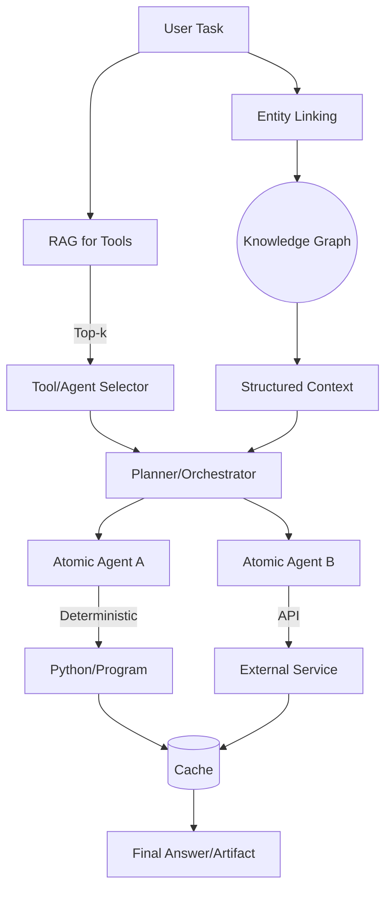

# Graph Theory & Machine Learning

This GitHub-style primer synthesizes Dharmesh Shah’s views on graphs, knowledge representation, and AI agents, with a focus on LLMs, agent ecosystems, and inference-time compute. Includes citations, diagrams-as-code, and practical patterns you can apply.

## TL;DR

- **Graphs are a native abstraction for AI systems**: People, ideas, tools, and agents are nodes in a network connected by relationships. Thinking this way clarifies composition, delegation, and discovery.
- **Agents will be networks, not monoliths**: “Atomic agents” (small, focused capabilities) compose into multi-agent systems via standards like MCP; treat tool calls as delegating to other nodes.
- **Knowledge representation improves recall, reasoning, and reliability**: Knowledge graphs help LLMs retrieve and reason over structured relationships; “RAG for tools” selects the right tool/agent on demand.
- **Inference-time compute matters**: Cache what you can (e.g., generated UIs); delegate specialized work (Python/math, APIs) to reduce hallucinations and cost.
- **Pragmatic engineering wins**: Under-engineer until the refactor cost stops trending to zero; avoid overcomplication until the payoff is clear.

References: Latent Space interview with Dharmesh Shah [1–7].

---

## 1) Why Graphs? A Mental Model For AI Systems

- **Nodes and relationships**: Dharmesh frames people, ideas, features, and now agents as nodes in a larger network. We “collect dots” (nodes) and “connect dots” (edges) over time [1].
- **Unified primitive**: Push the idea further: treat “tools” as “atomic agents” so you have one primitive—agents—composed into networks. Tool calling becomes agent-to-agent delegation [2].
- **Practical implication**: If the world is a graph, your AI stack benefits from:
  - Discovery layers (directories/registries of capabilities/agents)
  - Routing layers (which node to call next)
  - Memory layers (long-lived, addressable context)

> “What if everything was an agent? … There is a certain amount of elegance when you say we can reduce it down to one primitive … combine in complicated ways to accomplish higher‑order goals.” — Dharmesh Shah [2]

---

## 2) Knowledge Representation: From Text Blobs to Typed Edges

- **LLMs are great at language, not structure by default**: They benefit when the world is expressed as entities and relationships.
- **Knowledge Graphs (KGs)**:
  - Improve retrieval precision (structured queries over entities/relations)
  - Aid chain-of-thought by making relationships explicit
  - Enable constraint-based reasoning (types, directionality, weights)
- **RAG + KG**: Combine unstructured retrieval with KG lookups (entity linking → neighborhood expansion → ranked evidence synthesis).

Further reading:
- NVIDIA: LLM-driven Knowledge Graphs patterns and evaluation [8]
- Awesome Graph-LLM resources (papers, libs) [9]
- Tutorials on KGs + LLMs across pretraining/SFT/inference [10]

---

## 3) Agents: From Single Cells to Networks

- **Atomic agents**: Minimal, focused capabilities (the “single-cell organism”) [2].
- **Multi-agent systems**: The “year of agents” leads to “multi-agent networks” next—composition, delegation, and orchestration become central [2].
- **Standards unlock composition**: Dharmesh is bullish on MCP (Model Context Protocol) as a simple, usable standard to discover capabilities and wire up agents/tools cleanly [3,4].

> “I’m a big believer in multi-agent systems… We’re going to need a mechanism for discovery and a standard way… a directory of MCP servers… that’s going to unlock so many things.” — Dharmesh Shah [3]

- **Tool overload problem**: Too many tools break an LLM’s planning. Introduce a selection layer—“RAG for tools”—to shortlist tools/agents per task [5].

---

## 4) Inference-Time Compute: Cost, Latency, and Reliability

- **Delegate specialized work**: Early LLMs couldn’t do arithmetic reliably—give them a Python interpreter at runtime. Generalize this: delegate to deterministic subroutines for reliability and cost [7].
- **Cache when possible**: Generate UI/code once, then cache the artifact to avoid repeated inference costs during execution [7].
- **Under-engineer (pragmatically)**: When refactor costs trend to zero (thanks to better codegen/refactoring), it often pays to ship sooner and clean up later—avoid speculative complexity [6].

> “If the cost of fixing under-engineering trends towards zero… it makes the case for under engineering even stronger. You just pay the interest when you get there.” — Dharmesh Shah [6]

---

## 5) Practical Architecture Patterns

- **Tool/Agent Directory (MCP)**
  - Register agents with metadata: name, inputs/outputs, policies, cost, reliability
  - Enable discovery for composition
- **RAG for Tools**
  - Index tool/agent docs, capabilities, and examples
  - Retrieve top-k candidate tools for the current task
  - Optionally re-rank by success history/cost
- **KG-Enhanced Reasoning**
  - Entity-link user query
  - Expand KG neighborhood for relevant facts and constraints
  - Synthesize with text retrieval
- **Delegation + Caching**
  - Use interpreters/APIs for deterministic sub-steps
  - Cache compiled UI/code to avoid per-run inference
- **Async Agent UX**
  - Not all tasks are chat-synchronous; queue tasks, notify on completion [7]

---

## 6) Diagrams-as-Code

Graph view of an agentic system with KG and tool RAG:



Capability registry (YAML sketch):

```yaml
- id: "kg.lookup"
  type: "agent"
  inputs: ["entity_id", "relation_types"]
  outputs: ["neighbors", "evidence"]
  quality: {success_rate: 0.92}
  cost: {latency_ms_p50: 120}
  tags: ["knowledge-graph","retrieval"]

- id: "ui.gen"
  type: "agent"
  inputs: ["spec"]
  outputs: ["html","assets"]
  caching: "artifact"
  tags: ["generation","ui","cacheable"]
```

---

## 7) What This Buys LLMs, Agents, and Teams

- **For LLMs**
  - Fewer hallucinations via structured evidence
  - Better long-horizon planning with explicit relations
  - Lower cost via deterministic delegates and caching
- **For Agents**
  - Composability with MCP directories
  - Robust tool selection via “RAG for tools”
  - Clearer accountability with typed nodes/edges (who did what, why)
- **For Engineering**
  - Faster iteration (ship → observe → refactor)
  - Ability to under-engineer safely as refactor cost drops
  - Cleaner boundaries: generators, deterministic executors, caches

---

## 8) Extra: Open Graphs of People and Agents

Dharmesh floats an “OpenGraph” idea—portable self-owned data graphs (beyond today’s closed social/professional graphs) to empower agentic ecosystems and automation, ideally via open standards [4]. This aligns with agent directories, reputation systems, and provenance.

---

## References and Citations

1) Latent Space: The Agent Network — Dharmesh Shah (graph mindset; nodes and dots)
- https://www.latent.space/p/dharmesh (Transcript around 00:12:01)

2) Atomic agents, “everything is an agent” abstraction; year of multi-agent systems
- https://www.latent.space/p/dharmesh (Transcript 00:07:44–00:10:54)

3) MCP as a key unlock; discovery and directories; agent.ai context
- https://www.latent.space/p/dharmesh (Transcript 00:28:41–00:32:09)

4) Open standards mindset; “OpenGraph” thought experiment; user-owned data
- https://www.latent.space/p/dharmesh (Transcript 00:32:30–00:35:38)

5) Tool overload; need selection (“RAG for tools”)
- https://www.latent.space/p/dharmesh (Transcript 00:41:xx–00:44:37 region)

6) Pragmatism: over/under-engineering; ROI and refactor cost trending to zero
- https://www.latent.space/p/dharmesh (Transcript 00:19:59–00:24:45)

7) Inference-time compute: delegate math to Python; cache generated UI/code; async UX
- https://www.latent.space/p/dharmesh (Transcript 00:48:29–00:50:12)

Additional resources:
- NVIDIA: LLM-driven Knowledge Graphs patterns and evaluation
  - https://developer.nvidia.com/blog/insights-techniques-and-evaluation-for-llm-driven-knowledge-graphs/
- Awesome Graph-LLM collection
  - https://github.com/XiaoxinHe/Awesome-Graph-LLM
- Knowledge Graphs + LLMs roundup
  - https://github.com/heathersherry/Knowledge-Graph-Tutorials-and-Papers/blob/master/topics/Knowledge%20Graph%20and%20LLMs.md
